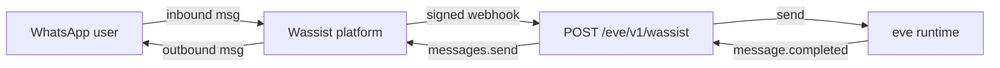

# @wassist/eve

The Wassist channel for [Vercel eve](https://github.com/vercel/eve) to add WhatsApp to any eve agent in 60 seconds.

[](https://www.npmjs.com/package/@wassist/eve)

Backed by the official [WhatsApp Business API](https://developers.facebook.com/docs/whatsapp) via [Wassist](https://wassist.app). Receive inbound WhatsApp messages as eve turns, reply with typing indicators, and ship outbound messages back to the user

## Want to skip the README? Deploy on Vercel

**Before you click Deploy**, grab two values from [wassist.app](https://wassist.app) — Vercel will prompt for both during clone:

1. **`WASSIST_API_KEY`** — at **Settings → API keys**, click **Create API key** and copy the value.
2. **`WASSIST_WEBHOOK_SECRET`** — at **Settings → Webhooks**, click **Create webhook**. Use any placeholder URL (e.g. `https://placeholder.example.com/eve/v1/wassist`) — you'll update it after deploying. Copy the signing secret it generates.

Now deploy:

[](https://vercel.com/new/clone?repository-url=https%3A%2F%2Fgithub.com%2FWassist%2Feve&root-directory=examples%2Fquickstart-whatsapp&project-name=wassist-eve-quickstart&env=WASSIST_API_KEY,WASSIST_WEBHOOK_SECRET)

Once deployed, head back to the dummy webhook in the Wassist dashboard and replace the placeholder URL with `https://<your-deployment>.vercel.app/eve/v1/wassist`. Done.

## Quickstart 

In your eve project, install the package and create the channel file.

Requires an eve project (`npx eve@latest init my-agent` if you're starting from scratch) and Node.js >= 18.

### 1. Install

```bash
npm install @wassist/eve
pnpm install @wassist/eve
```

### 2. Create the channel file

Add `agent/channels/whatsapp.ts` to your eve project:

```ts
import { wassistChannel } from "@wassist/eve";

export default wassistChannel({
  credentials: {
    apiKey: process.env.WASSIST_API_KEY!,
    webhookSecret: process.env.WASSIST_WEBHOOK_SECRET!,
  },
});
```

That's it — eve auto-loads everything in `agent/channels/`, so your agent now answers WhatsApp.

### 3. Get your Wassist credentials

Sign up at [**wassist.app**](https://wassist.app), then grab two values from the dashboard:

| Env var | How to get it |
|---|---|
| `WASSIST_API_KEY` | **Settings → API keys** → **Create API key** → copy the value. |
| `WASSIST_WEBHOOK_SECRET` | **Settings → Webhooks** → **Create webhook**. The signing secret is generated when you create the webhook, so you need to create one before you can deploy. Use a placeholder URL like `https://placeholder.example.com/eve/v1/wassist` for now — you'll update it in step 5. |

Drop both into your `.env.local` (and your hosting provider's environment variables).

### 4. Expose your agent over HTTPS

Wassist needs a public URL to POST signed webhooks to.

**Production / staging** — deploy your eve agent anywhere that gives you a public HTTPS URL. The Vercel one-click above is the fastest path:

[](https://vercel.com/new/clone?repository-url=https%3A%2F%2Fgithub.com%2FWassist%2Feve&root-directory=examples%2Fquickstart-whatsapp&project-name=wassist-eve-quickstart&env=WASSIST_API_KEY,WASSIST_WEBHOOK_SECRET)

**Local dev** — run your agent and tunnel it with [ngrok](https://ngrok.com) or [cloudflared](https://developers.cloudflare.com/cloudflare-one/connections/connect-networks/):

```bash
# Terminal 1 — start the agent
npm run dev

# Terminal 2 — expose port 3000 (or whatever your agent uses)
ngrok http 3000
```

ngrok prints a public URL like `https://abc123.ngrok.app`. Note that it changes every restart unless you have a [reserved domain](https://ngrok.com/docs/network-edge/domains-and-tcp-addresses/) — you'll need to update the Wassist webhook URL each time.

### 5. Register the webhook URL in Wassist

In the [Wassist dashboard](https://wassist.app) → **Settings → Webhooks**, set the webhook URL to:

```
https://<your-public-url>/eve/v1/wassist
```

For example: `https://my-agent.vercel.app/eve/v1/wassist` or `https://abc123.ngrok.app/eve/v1/wassist`.

(Override the path via the `route` config option if you need something else — see below.)

### 6. Subscribe your phone number to the webhook

The channel listens for [`subscription.message.received`](https://docs.wassist.app/guides/webhooks/routing) — Wassist's "this conversation is routed to my webhook" event. Without a subscription, inbound messages stay on the broadcast `message.received` event and never reach the channel.

In the Wassist dashboard, open the phone number you want the agent to answer and subscribe it to the webhook you registered in step 5. You can also subscribe individual conversations instead of the whole number — see the [routing guide](https://docs.wassist.app/guides/webhooks/routing).

### 7. Send your bot a WhatsApp message

Open WhatsApp, message your connected number, and watch your eve agent reply.

## How it works



1. A WhatsApp user messages your number.
2. Wassist POSTs a signed webhook to `POST /eve/v1/wassist`.
3. The channel verifies the `X-Wassist-Signature` header with your webhook secret.
4. On [`subscription.message.received`](https://docs.wassist.app/guides/webhooks/routing) — the event Wassist emits when a conversation has been routed to your webhook via `phoneNumbers.subscribe` or `conversations.subscribe` — the channel dispatches the message into eve via `send()`, keyed by the Wassist conversation ID as the eve continuation token. The legacy `message.received` broadcast event is intentionally ignored to avoid double-handling.
5. eve runs its turn. When the turn emits `message.completed`, the channel ships the reply text back to Wassist with `wassist.conversations.messages.send(...)`.
6. eve's `turn.started` triggers a WhatsApp typing indicator via `wassist.conversations.typing(...)`.

## Configuration

```ts
wassistChannel({
  credentials: {
    apiKey: process.env.WASSIST_API_KEY!,
    webhookSecret: process.env.WASSIST_WEBHOOK_SECRET!,
  },
  senderWhitelist: ["+1 415 555 0100", "+447700900123"],
  route: "/eve/v1/wassist",
  baseUrl: "https://backend.wassist.app",
});
```

| Option | Type | Default | Description |
|---|---|---|---|
| `credentials.apiKey` | `string` | `process.env.WASSIST_API_KEY` | Wassist API key. |
| `credentials.webhookSecret` | `string` | `process.env.WASSIST_WEBHOOK_SECRET` | Webhook signing secret. |
| `senderWhitelist` | `string[]` | `undefined` (all senders allowed) | Phone numbers permitted to message the agent. Inbound messages from any other sender are rejected with HTTP 401. Entries are compared after stripping whitespace and `+` symbols, so `"+1 415 555 0100"`, `"+14155550100"`, and `"14155550100"` are all equivalent. |
| `route` | `string` | `"/eve/v1/wassist"` | HTTP path the channel listens on. Must match the webhook URL you set in the Wassist dashboard. |
| `baseUrl` | `string` | `"https://backend.wassist.app"` | Wassist API base URL. Only override for self-hosted Wassist or non-prod backends. |

If both `credentials.apiKey` and `WASSIST_API_KEY` are missing the channel throws a descriptive error at construction time — your agent won't boot with a misconfigured channel.

## Troubleshooting

**`Missing Wassist API key` at startup.** Set `WASSIST_API_KEY` in your environment or pass it explicitly via `credentials.apiKey`. Get a key at [wassist.app → Settings → API keys](https://wassist.app).

**`Invalid Wassist webhook signature` (HTTP 400).** The `WASSIST_WEBHOOK_SECRET` in your environment doesn't match the signing secret in the Wassist dashboard. Copy it again from **Settings → Webhooks → Signing secret**.

**Wassist dashboard shows webhook deliveries failing with 404.** Your `route` config and the webhook URL in the Wassist dashboard are out of sync. Defaults assume `/eve/v1/wassist`.

**ngrok URL changed.** Free ngrok URLs rotate on every restart. Update the webhook URL in the Wassist dashboard, or [reserve a domain](https://ngrok.com/docs/network-edge/domains-and-tcp-addresses/).

## Examples

- [`quickstart-whatsapp`](https://github.com/Wassist/eve/tree/main/examples/quickstart-whatsapp) — minimal deployable eve agent wired to `@wassist/eve`. One-click deploy on Vercel.

## Links

- [Wassist documentation](https://docs.wassist.app/api-reference)
- [`@wassist/sdk`](https://www.npmjs.com/package/@wassist/sdk) — the TypeScript client this channel uses under the hood
- [`@wassist/cli`](https://www.npmjs.com/package/@wassist/cli) — manage your WhatsApp agents from the terminal
- [Vercel eve](https://github.com/vercel/eve) — the framework for building agents

## License

MIT
